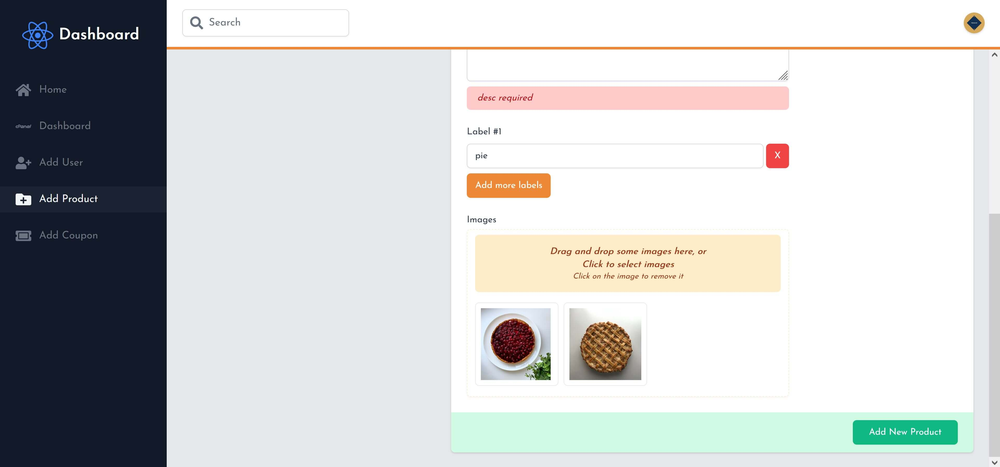

<a href="https://trishop.vercel.app">
  

    
  

  <h1 style="color: #D5A95B;" align="center">
    Trishop
  </h1>
</a>

  <strong style="font-style: italic;">Open Source E-Commerce Platform</strong>

  

  

  

  

<h3 align="center">
  <a href="https://discord.gg/W9gPJ6kUPY">📢 Discord Contributors Community 📢</a>
</h3>

---

## What is Trishop ❓

Trishop adalah platform e-commerce gratis dan open-source untuk unit usaha yang ingin mencari customer dan menjual produk nya secara online. Platform ini berbeda dengan platform seperti Shopee, Tokopedia atau sejenisnya yang menggunakan sistem multi-role user dimana user bisa registrasi sebagai pembeli dan penjual sekaligus. Platform ini dimaksudkan hanya untuk satu penjual dan semua customer online nya.

## Features 🎲

Trishop dilengkapi dengan fitur:

1. 90% typed Next.js dengan Typescript + Eslint + Prettier ⚡
2. Peyimpanan database dengan Mongodb dan Mongoose ODM 🍃
3. Penyimpanan file storage dengan Cloudinary 💾
4. Dokumentasi komponen UI dengan Storybook dan mendeploy nya ke Chromatic 🌸
5. Autentikasi JWT dalam cookie 🔑
6. Otorisasi berdasarkan role: USER dan ADMIN 🔐
7. Form validation dengan Formik dan Yup ✨
8. Customer cart dan wishlist dengan react `context` dan `reducer` 🛠
9. Customer order dan checkout product dengan custom hooks `useLocalStorage` ⚒
10. Custom API routes middleware validation 🎊
11. Review product dengan menyertakan nama, komentar dan bintang ⭐
12. Report review yang terindikasi spam / mengandung SARA 🚫
13. Memakai coupon code ketika di cart bagi customer yang memilikinya 👩‍💻
14. Customer dashboard ~~untuk memantau order product yang telah dibeli~~ 🕵️‍♀️
15. Admin dashboard untuk fungsi CRUD user, product, coupons, reports, ~~dan memantau status order product~~ 💎
16. dll...

## Services 👜

|                     Service                     |            Description            |
| :---------------------------------------------: | :-------------------------------: |
|          [vercel](https://vercel.com/)          |          Next.js Hosting          |
|      [cloudinary](https://cloudinary.com)       |       File Storage Solution       |
| [mongodb](https://www.mongodb.com/cloud/atlas/) |          NoSQL Database           |
|       [chromatic](https://chromatic.com/)       |         Storybook Hosting         |
|        [midtrans](https://midtrans.com/)        | Payment Gateway **(coming soon)** |
|         [cypress](https://cypress.io/)          |   E2E Testing **(coming soon)**   |

## Branches 🔱

- [develop](https://github.com/rifandani/trishop/tree/develop) -> **Pull Request** branch ini untuk kontribusi
- [main](https://github.com/rifandani/trishop) -> Jangan disentuh, branch ini untuk production

## Screenshots 📷

- Halaman products

  

- Halaman product detail

  

- Halaman cart

  

- Halaman checkout

  

- Halaman admin dashboard

  

- Halaman admin dashboard add product

  

## Usage 🏀

Untuk menjalankan project ini di local, ikuti langkah berikut:

1. Clone repo ini
2. Jalankan `yarn` atau `npm install`
3. Jalankan `yarn dev` untuk menjalankan nextjs frontend dan backend di port `3000`
4. Backend API berada pada folder `/pages/api/v1`
5. Jalankan `yarn storybook` untuk menjalankan storybook UI component di port `6006`

## Contributing 🧩

Trishop web dibuka untuk kontribusi baik itu kontribusi untuk fungsionalitas project ataupun berupa dokumentasi. Saya merekomendasikan kalian membuat issue baru atau ikut bergabung dalam komunitas Discord agar saya dapat mengetahui terlebih dahulu apa yang kalian ingin tambahkan/kerjakan sehingga project bisa lebih terkoordinir dan apa yang kita kerjakan tidak akan saling bertabrakan.

Silahkan baca [CONTRIBUTING.md](https://github.com/rifandani/trishop/blob/develop/CONTRIBUTING.md) untuk mengetahui lebih detailnya.

## Code of Conduct 📐

Dibuat dengan tujuan agar semua partisipan atau contributors di project ini terbebas dari segala macam bentuk diskriminasi, penghinaan, ancaman, kekerasan, ataupun yang sejenisnya.

Silahkan baca [CODE_OF_CONDUCT.md](https://github.com/rifandani/trishop/blob/develop/CODE_OF_CONDUCT.md) untuk mengetahui lebih detailnya.

## Change Log 📜

Digunakan untuk tracking major update dan breaking changes terhadap project.

Silahkan baca [CHANGELOG.md](https://github.com/rifandani/trishop/blob/develop/CHANGELOG.md) untuk mengetahui lebih detailnya.

## License 📄

[MIT](https://github.com/rifandani/trishop/blob/develop/LICENSE)
